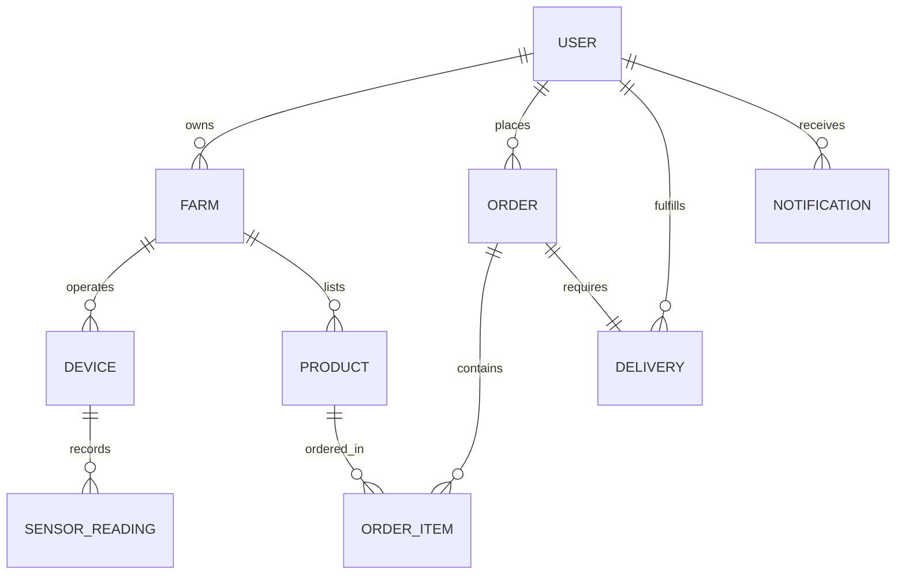

# Smart Poultry Farm Automation System - Implemented Backend Functionalities

## Executive Summary

The backend for the **Smart Poultry Farm Automation System** is a robust, modular, production-ready RESTful API built using **Node.js**, **Express.js**, and **Sequelize ORM** connecting to **MySQL in XAMPP**. 

It bridges IoT hardware automation (ESP32 microcontrollers), AI-powered computer vision health detection, multi-farm management, e-commerce marketplace operations, order logistics delivery, and platform-wide administrative governance.

---

## 🏗️ Project Architecture & Directory Structure

```text
MY PROJECT/
├── BACK END/
│   ├── index.js                     # Express application entry point & DB sync
│   ├── package.json                 # Dependencies & scripts (express, sequelize, jwt, bcryptjs, etc.)
│   ├── .env                         # Active environment configuration
│   ├── .env.example                 # Environment configuration template
│   ├── test_backend.js              # Automated end-to-end integration test suite
│   └── src/
│       ├── config/
│       │   └── database.js          # Sequelize connection & dialect fallback handling
│       ├── middleware/
│       │   ├── authMiddleware.js    # JWT verification & Role-Based Access Control (RBAC)
│       │   └── errorHandler.js      # Centralized error handling middleware
│       ├── models/
│       │   ├── User.js              # User model with bcrypt password hashing
│       │   ├── Farm.js              # Farm registry entity
│       │   ├── Device.js            # IoT Hardware & threshold configurations
│       │   ├── SensorReading.js     # Environmental & feed/water telemetry
│       │   ├── Product.js           # Marketplace inventory & pricing
│       │   ├── Order.js             # Order transaction model
│       │   ├── OrderItem.js         # Order line items detail model
│       │   ├── Delivery.js          # Logistics driver assignment & status model
│       │   ├── Notification.js      # Multi-channel alert feed model
│       │   └── index.js             # Relational associations setup
│       ├── controllers/             # Business logic controllers
│       │   ├── authController.js
│       │   ├── farmController.js
│       │   ├── deviceController.js
│       │   ├── sensorController.js
│       │   ├── aiController.js
│       │   ├── productController.js
│       │   ├── orderController.js
│       │   ├── deliveryController.js
│       │   ├── notificationController.js
│       │   └── adminController.js
│       └── routes/                  # Express Router modules
│           ├── authRoutes.js
│           ├── farmRoutes.js
│           ├── deviceRoutes.js
│           ├── sensorRoutes.js
│           ├── aiRoutes.js
│           ├── productRoutes.js
│           ├── orderRoutes.js
│           ├── deliveryRoutes.js
│           ├── notificationRoutes.js
│           └── adminRoutes.js
```

---

## 🔐 1. Role-Based Access Control (RBAC) & Security

The system implements strict JWT (JSON Web Token) authentication paired with granular role-based authorization.

### Supported Roles:
1. **Administrator**: Full system governance, platform analytics, user role modifications, and global resource management.
2. **Farmer**: Manages owned farms, registers ESP32 IoT devices, configures automation thresholds, receives AI/sensor alerts, manages marketplace inventory, and handles incoming farm orders.
3. **Customer**: Browses farm products, manages shopping cart, places marketplace orders, and tracks order fulfillment/delivery.
4. **Delivery Person**: Views assigned delivery tasks, updates logistics stages (`accepted` ➔ `picked_up` ➔ `delivered`), and confirms fulfillment.

---

## ⚡ 2. Module-by-Module Implemented Functionalities

### Module 1: Authentication & User Profiles (`/api/auth`)
* **`POST /api/auth/register`**: Registers a new user with automatic password hashing (bcrypt, 10 salt rounds). Accepts role designation (`Administrator`, `Farmer`, `Customer`, `Delivery Person`).
* **`POST /api/auth/login`**: Authenticates credentials, generates a signed JWT token (expires in 7 days), and returns user profile info.
* **`GET /api/auth/profile`**: Protected route fetching the authenticated user's details.

### Module 2: Farm Management (`/api/farms`)
* **`POST /api/farms`**: Creates a new farm profile (location, total capacity, current poultry count). Farmers are automatically linked to their farms.
* **`GET /api/farms`**: Lists all farms (Farmers view their own farms; Admins view all platform farms).
* **`GET /api/farms/:id`**: Fetches detailed farm specs including associated IoT hardware devices and farmer information.
* **`PUT /api/farms/:id`**: Updates farm capacity, current poultry counts, or location.
* **`DELETE /api/farms/:id`**: Removes a farm record.

### Module 3: IoT Device Management & Thresholds (`/api/devices`)
* **`POST /api/devices`**: Registers IoT devices (ESP32 microcontrollers, Multi-Sensors, Smart Cameras) linked to a specific farm.
* **`GET /api/devices`**: Lists registered devices filtered by `farmId`.
* **`PUT /api/devices/:id`**: Configures automated environmental & feed thresholds per device:
  - `foodThreshold` (Min food % level before triggering auto-dispenser)
  - `waterThreshold` (Min water % level before triggering auto-refill valve)
  - `tempMin` & `tempMax` (Optimal temperature range in °C)
  - `humidityMin` & `humidityMax` (Optimal relative humidity range %)
* **`DELETE /api/devices/:id`**: Unregisters an IoT device.

### Module 4: Sensor Monitoring & Automation Rules Engine (`/api/sensors`)
* **`POST /api/sensors/telemetry`**: Telemetry ingestion endpoint for ESP32 hardware sending food level, water level, temperature, and humidity.
* **🤖 Automated Rules Engine**:
  - If **food level < foodThreshold**: Automatically triggers `'AUTOMATIC_FEEDING_DISPENSER_ON'` and generates a `Low Food Level Warning` notification for the farmer.
  - If **water level < waterThreshold**: Automatically triggers `'AUTOMATIC_WATER_VALVE_OPEN'` and generates a `Low Water Level Warning` notification for the farmer.
  - If **temperature > tempMax**: Automatically triggers `'FAN_COOLING_ON'` and generates a `Temperature Threshold Alert`.
  - If **temperature < tempMin**: Automatically triggers `'HEATER_ON'` and generates a `Temperature Threshold Alert`.
* **`GET /api/sensors/live/:deviceId`**: Retrieves the most recent real-time sensor snapshot.
* **`GET /api/sensors/history/:deviceId`**: Fetches historical telemetry data points for charting & trend analysis.

### Module 5: AI Health Detection & Anomaly Alerts (`/api/ai`)
* **`POST /api/ai/health-alert`**: Integration endpoint for Python Computer Vision inference services analyzing camera streams.
* Logs anomaly confidence scores, disease symptoms (e.g. lethargy, wing drooping, flocking isolation), and immediately emits high-priority `ai_alert` notifications to the responsible farmer.

### Module 6: Product Management & Marketplace Catalog (`/api/products`)
* **`GET /api/products`**: Public endpoint for customers to browse marketplace items with search keywords, category filters (Live Poultry, Eggs, Feed, Meat), price range filters, and farm filters.
* **`GET /api/products/:id`**: Views detailed product specs.
* **`POST /api/products`**: Allows farmers to list products linked to their farms (unit price, stock quantity, unit measure, image URL).
* **`PUT /api/products/:id`**: Updates stock levels, pricing, or product availability.
* **`DELETE /api/products/:id`**: Removes a product from the catalog.

### Module 7: Order Management & Checkout Workflow (`/api/orders`)
* **`POST /api/orders`**: Customer checkout endpoint. Executes a **database transaction**:
  1. Validates product availability and stock quantities.
  2. Automatically decrements inventory stock.
  3. Calculates total purchase amount.
  4. Creates `Order` and `OrderItem` records.
  5. Automatically creates an `unassigned` `Delivery` task record.
  6. Sends instant order notifications to affected farmers.
* **`GET /api/orders`**: Lists orders (Customers view their order history; Farmers view orders containing products from their farms).
* **`PUT /api/orders/:id/status`**: Updates order state (`pending` ➔ `accepted` ➔ `rejected` ➔ `in_transit` ➔ `delivered` ➔ `cancelled`).

### Module 8: Delivery & Logistics Tracking (`/api/deliveries`)
* **`PUT /api/deliveries/:id/assign`**: Assigns a delivery task to a registered `Delivery Person`.
* **`GET /api/deliveries`**: Allows drivers to view their assigned delivery tasks and customer drop-off addresses.
* **`PUT /api/deliveries/:id/status`**: Updates delivery state (`assigned` ➔ `accepted` ➔ `picked_up` ➔ `delivered`). Transition to `picked_up` automatically sets order status to `in_transit`; transition to `delivered` completes the order workflow.

### Module 9: Real-time Notifications & Alerts System (`/api/notifications`)
* **`GET /api/notifications`**: Retrieves user notifications inbox categorized by alert type (`ai_alert`, `environmental_alert`, `order_update`, `delivery_update`).
* **`PUT /api/notifications/:id/read`**: Marks a specific notification as read.
* **`PUT /api/notifications/read-all`**: Marks all notifications in inbox as read.

### Module 10: Administration & Platform Governance (`/api/admin`)
* **`GET /api/admin/stats`**: Platform overview metric dashboard returning:
  - Total registered users
  - Total registered farms
  - Active IoT devices count
  - Total marketplace orders
  - Total platform gross revenue
* **`GET /api/admin/users`**: Lists all platform accounts.
* **`PUT /api/admin/users/:id/role`**: Modifies user role privileges.
* **`DELETE /api/admin/users/:id`**: Administrative account termination.

---

## 🗄️ 3. Relational Database Schema Overview



---

## 🚀 4. How to Run & Test the Backend

### Prerequisites
- Node.js (v18+ recommended)
- NPM

### Step 1: Environment Setup
Ensure `.env` in `BACK END/` contains your configuration:
```env
PORT=3000
NODE_ENV=development
DB_DIALECT=sqlite
DB_STORAGE=./smart_poultry_farm.sqlite
JWT_SECRET=super_secret_smart_poultry_farm_jwt_key_2026
```

### Step 2: Start Development Server
```bash
cd "BACK END"
npm run dev
```

### Step 3: Run Automated Integration Test Suite
```bash
cd "BACK END"
node test_backend.js
```

---

## 📌 Summary Matrix of Completed Development Phases

| Phase # | Development Phase | Implemented Status |
| :---: | :--- | :---: |
| **Phase 1** | Project Setup (Express, Sequelize, DB) | ✅ Completed |
| **Phase 2** | Authentication & User Management (JWT, RBAC, 4 Roles) | ✅ Completed |
| **Phase 3** | Farm Management (Farm CRUD, Farmer association) | ✅ Completed |
| **Phase 4** | IoT Device Management (ESP32 registration, thresholds) | ✅ Completed |
| **Phase 5** | Sensor Monitoring (Telemetry ingestion & history) | ✅ Completed |
| **Phase 6** | Automation Engine (Feed/water dispensers & climate control) | ✅ Completed |
| **Phase 7** | AI Health Detection (CV anomaly ingest & alerts) | ✅ Completed |
| **Phase 8** | Product Management (Inventory & catalog CRUD) | ✅ Completed |
| **Phase 9** | Online Marketplace (Public catalog search & filtering) | ✅ Completed |
| **Phase 10** | Order Management (Checkout, stock deduction, order workflow) | ✅ Completed |
| **Phase 11** | Delivery Management (Logistics tracking & driver assignment) | ✅ Completed |
| **Phase 12** | Notification System (Alert inbox & read tracking) | ✅ Completed |
| **Phase 13** | Administration (Platform stats & user governance) | ✅ Completed |
| **Phase 14** | Testing & Deployment Preparation (Automated test suite) | ✅ Completed |
