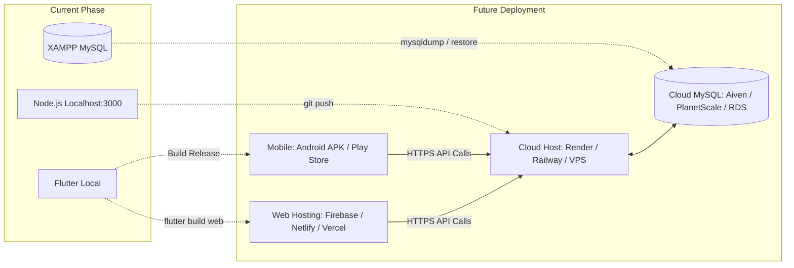

# NOVARA Smart Poultry System — Installation & Setup Guide
*(Local Development & Pre-Deployment Blueprint)*

---

## 1. Overview & Prerequisites

This guide walks you through setting up and running the complete **NOVARA** application locally on your machine, connecting the **Node.js Backend**, the **MySQL Database (via XAMPP)**, and the **Flutter Frontend** (Web, Desktop, Android Emulator, or Physical Phone), and prepares you for eventual cloud deployment.

### System Prerequisites
Ensure you have the following installed on your machine:
- **Node.js**: v18.x or v20.x LTS ([Download Node.js](https://nodejs.org/))
- **Flutter SDK**: v3.22.x or newer ([Download Flutter](https://flutter.dev/))
- **XAMPP** (or standalone MySQL): For local MySQL database ([Download XAMPP](https://www.apachefriends.org/))
- **Git**: For version control
- **Android Studio / VS Code**: Recommended code editors with Dart and Flutter extensions

---

## 2. Step-by-Step Local Installation

### 2.1 Step 1: Database Setup (XAMPP MySQL)

1. **Start MySQL in XAMPP**:
   - Open **XAMPP Control Panel**.
   - Click **Start** next to **MySQL** (and **Apache** if you want to use phpMyAdmin).
   - Ensure MySQL is running on default port **`3306`**.

2. **Database Auto-Initialization**:
   - The NOVARA backend has an automatic database initializer in `src/config/database.js`.
   - When the backend starts, it automatically executes:
     ```sql
     CREATE DATABASE IF NOT EXISTS `NOVARA`;
     ```
   - It will automatically create and sync all tables (`Users`, `Farms`, `Devices`, `SensorReadings`, `Products`, `Orders`, `OrderItems`, `Deliveries`, `Notifications`).

3. *(Optional)* **Import Initial Seed Data / Backup**:
   - If you want to restore pre-existing test data and sample products:
     - Open **phpMyAdmin** (`http://localhost/phpmyadmin/`).
     - Click on the **`NOVARA`** database.
     - Go to the **Import** tab.
     - Choose file: `MY PROJECT/novara_backup_utf8.sql` (or `BACK END/novara_backup_20260918.sql`).
     - Click **Import**.

---

### 2.2 Step 2: Backend Setup (Node.js & Express)

1. **Open Terminal** and navigate to the backend directory:
   ```powershell
   cd "c:\Users\Dalia Tchoutan\Desktop\MY PROJECT\BACK END"
   ```

2. **Verify Environment Variables (`.env`)**:
   Ensure your `.env` file exists in the `BACK END/` folder with the following settings:
   ```env
   PORT=3000
   NODE_ENV=development

   # Database Configuration for XAMPP
   DB_DIALECT=mysql
   DB_HOST=127.0.0.1
   DB_PORT=3306
   DB_USER=root
   DB_PASS=
   DB_NAME=NOVARA

   # JWT Authentication
   JWT_SECRET=super_secret_smart_poultry_farm_jwt_key_2026
   JWT_EXPIRES_IN=7d
   ```
   > [!NOTE]
   > If your XAMPP MySQL root user has a password, enter it in `DB_PASS=your_password`. By default in XAMPP, `DB_PASS` is empty.

3. **Install Dependencies**:
   ```powershell
   npm install
   ```

4. **Start the Backend Server**:
   - For standard mode:
     ```powershell
     npm start
     ```
   - For development mode (with auto-restart on code changes):
     ```powershell
     npm run dev
     ```

5. **Verify the Backend is Running**:
   - Open your browser or run:
     ```text
     http://localhost:3000/health
     ```
   - You should see:
     ```json
     { "status": "UP", "timestamp": "..." }
     ```

6. **Run Automated Backend Unit Tests**:
   Verify that all business logic and security routes are passing:
   ```powershell
   npm test
   ```
   *(To test specifically authentication routes: `npm run test:auth`)*

---

### 2.3 Step 3: Frontend Setup (Flutter)

1. **Open a New Terminal** and navigate to the frontend directory:
   ```powershell
   cd "c:\Users\Dalia Tchoutan\Desktop\MY PROJECT\FRONT END"
   ```

2. **Install Flutter Dependencies**:
   ```powershell
   flutter pub get
   ```

3. **Verify Code Health**:
   ```powershell
   flutter analyze
   ```
   *(Should report: `No issues found!`)*

4. **Configure Network / API Endpoint (`lib/config/api_config.dart`)**:
   The app automatically adapts its base URL depending on the platform:
   - **Chrome / Web**: `http://localhost:3000`
   - **Windows Desktop**: `http://localhost:3000`
   - **Android Emulator**: `http://10.0.2.2:3000` *(Android emulator uses 10.0.2.2 to access host PC localhost)*
   - **Physical Mobile Phone (via Wi-Fi)**:
     If you connect a physical phone to test over local Wi-Fi, update line 13 in `lib/config/api_config.dart` with your computer's local Wi-Fi IP:
     ```dart
     return 'http://192.168.1.X:3000'; // Replace with your PC IPv4 address
     ```
     *(Find your PC's IP by running `ipconfig` in PowerShell).*

---

### 2.4 Step 4: Launching the Application

Choose whichever platform you prefer to test on:

#### Option A: Run in Chrome Browser (Fastest for UI testing)
```powershell
flutter run -d chrome
```

#### Option B: Run on Windows Desktop
```powershell
flutter run -d windows
```

#### Option C: Run on Android Emulator or USB Device
1. Start your Android Emulator in Android Studio or plug in your physical Android phone via USB (with USB Debugging enabled).
2. Run:
```powershell
flutter run
```

---

## 3. Initial App Walkthrough & First Test Run

Once the app is running:

1. **Explore as Guest**:
   - Tap **"Explore Marketplace as Visitor"** to browse preloaded poultry products, eggs, and feeds.
2. **Create Test Accounts**:
   - Tap **"Create Account"** to create test users for each role:
     - **Customer**: `customer@test.com` / `password123`
     - **Farmer**: `farmer@test.com` / `password123`
     - **Delivery Person**: `delivery@test.com` / `password123`
3. **Admin Verification Flow**:
   - Log in with the preconfigured Admin account (or use your admin credentials).
   - In the **Farmers Directory** tab, tap **"Approve"** on your newly created farmer account.
4. **Test IoT Telemetry Simulation**:
   - To simulate a live IoT ESP32 device posting sensor data to your local backend without hardware, run:
     ```powershell
     node test_backend.js
     ```
   - This ingests live temperature, humidity, food, and water telemetry and triggers automation alerts.

---

## 4. Pre-Deployment Blueprint (When You Are Ready to Deploy)

When you are ready to publish NOVARA to production, follow this deployment roadmap:



### 4.1 Step A: Deploying the Backend API
Recommended free/low-cost platforms for Node.js:
- **Render** ([render.com](https://render.com)) or **Railway** ([railway.app](https://railway.app)).
1. Push your code to GitHub.
2. Link your repository to Render or Railway.
3. Set the build command: `npm install` and start command: `node index.js`.
4. Add environment variables in the cloud dashboard (`PORT`, `JWT_SECRET`, `DB_HOST`, `DB_USER`, `DB_PASS`, `DB_NAME`).

### 4.2 Step B: Cloud MySQL Database
- Create a free cloud MySQL instance on **Aiven** ([aiven.io](https://aiven.io)) or **Railway**.
- Export your local database schema:
  ```powershell
  mysqldump -u root -p NOVARA > production_dump.sql
  ```
- Import `production_dump.sql` into your cloud MySQL database.

### 4.3 Step C: Point Frontend to Production Backend
Once your backend is live (e.g. `https://novara-api.onrender.com`), update `lib/config/api_config.dart`:
```dart
static String get serverUrl {
  if (kReleaseMode) {
    return 'https://novara-api.onrender.com'; // Production Cloud API URL
  }
  // Local fallback for development...
  return 'http://localhost:3000';
}
```

### 4.4 Step D: Building Release Packages
- **Build Android APK** (to install directly on any Android phone):
  ```powershell
  flutter build apk --release
  ```
  The installable `.apk` file will be generated at:
  `FRONT END/build/app/outputs/flutter-apk/app-release.apk`

- **Build Web Bundle** (to host on Firebase Hosting, GitHub Pages, or Netlify):
  ```powershell
  flutter build web --release
  ```
  The deployable static website will be located in: `FRONT END/build/web`.

---

## 5. Troubleshooting Common Local Issues

| Issue | Cause | Resolution |
| :--- | :--- | :--- |
| `ECONNREFUSED 127.0.0.1:3306` | MySQL is stopped in XAMPP | Open XAMPP Control Panel and click **Start** on MySQL. |
| `Port 3000 is already in use` | Another process is occupying port 3000 | Change `PORT=3001` in `.env` or terminate the existing Node process. |
| `SocketException: Connection refused (OS Error: 111)` on Android | Android emulator trying to call `localhost` | Ensure `api_config.dart` uses `http://10.0.2.2:3000` for Android. |
| `Image not showing in Flutter` | Backend server not running | Product images are served via `http://localhost:3000/uploads/`. Ensure backend is active. |
| `flutter analyze` linter issues | Outdated pub packages | Run `flutter pub get` and verify that no dart syntax errors exist. |
