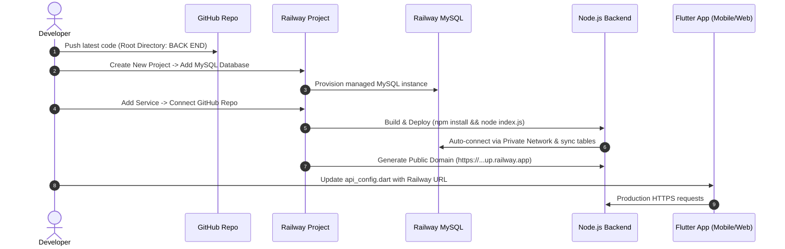

# NOVARA Smart Poultry System — Railway Deployment Guide
*(Complete Step-by-Step Production Deployment Blueprint)*

---

## 1. Is Railway a Good Choice for NOVARA?

**Yes, Railway is one of the absolute best choices for this specific application.**

### Why Railway is Ideal for NOVARA:
| Key Requirement | Why Railway Excels | Comparison With Other Cloud Hosts |
| :--- | :--- | :--- |
| **MySQL Database Support** | Native **1-click managed MySQL** plugin inside your project dashboard. | Vercel, Netlify, and Render do NOT have native free MySQL (they require external database providers). |
| **Private Networking** | The Node.js backend talks to MySQL over a private internal network with **0ms latency** and high security. | External databases incur network latency and complex IP whitelisting. |
| **Auto-Configuration** | Railway automatically provisions `MYSQLHOST`, `MYSQLUSER`, `MYSQLPASSWORD`, `MYSQLPORT`, `MYSQLDATABASE`. Our backend code in `src/config/database.js` has already been pre-configured to detect these instantly. | Other platforms require tedious manual environment variable mapping. |
| **Monorepo Support** | Railway allows setting the **Root Directory** directly to `BACK END`. | Many hosts require separate repositories. |
| **Instant Free SSL** | Generates an official `https://*.up.railway.app` URL with automated SSL certificates. | No domain purchase or SSL configuration needed to get started. |
| **Affordable / Low Barrier** | Provides free credit to get started and low-cost pay-as-you-go pricing for ongoing usage. | AWS/GCP have high complexity and unexpected billing traps. |

---

## 2. Prerequisites Before You Begin

1. **A GitHub Account**: Railway deploys directly from your GitHub repository.
2. **Git installed on your PC**.
3. **Railway Account**: Sign up at [railway.app](https://railway.app) (click **Login with GitHub**).

---

## 3. Step-by-Step Deployment Walkthrough



---

### Step 1: Commit & Push Your Code to GitHub

1. Open PowerShell in your project directory:
   ```powershell
   cd "c:\Users\Dalia Tchoutan\Desktop\MY PROJECT"
   ```
2. Commit your latest backend updates:
   ```powershell
   git add .
   git commit -m "feat: configure backend for seamless Railway deployment"
   ```
3. Push to your GitHub repository:
   ```powershell
   git push origin main
   ```
   *(If you haven't linked a remote yet: `git remote add origin https://github.com/<your-username>/<your-repo-name>.git` and push).*

---

### Step 2: Create a Project & Add MySQL in Railway

1. Go to [railway.app](https://railway.app) and sign in.
2. Click **"New Project"**.
3. Select **"Provision MySQL"** (or click **`+ New`** → **Database** → **Add MySQL**).
4. Railway will create a running MySQL instance in approximately 10 seconds.
5. Click on the **MySQL** service card:
   - Go to the **Variables** tab to see your credentials (`MYSQLHOST`, `MYSQLPORT`, `MYSQLUSER`, `MYSQLPASSWORD`, `MYSQLDATABASE`).

---

### Step 3: (Optional) Import Seed Products & Test Data

Railway allows you to import existing data in two easy ways:

- **Method A (Easiest — Automatic Sync)**:
  Our Sequelize backend in `src/config/database.js` automatically runs schema synchronization and column patching on first boot! You don't even have to import anything manually if you want a clean database.
- **Method B (Importing `novara_backup_utf8.sql`)**:
  In Railway's MySQL card:
  1. Go to the **Data** tab to use the built-in web table editor.
  2. Or go to the **Connect** tab, copy the **Public Connection URL**, and connect using **DBeaver**, **TablePlus**, or MySQL Workbench to import `novara_backup_utf8.sql`.

---

### Step 4: Deploy the Node.js Backend Service

1. In your Railway project dashboard, click **`+ New`** (top right) → **GitHub Repo**.
2. Select your project repository.
3. Railway will add a new service card. Click on it, then select **Settings**:
   - Scroll down to **Root Directory** and enter:
     ```text
     BACK END
     ```
     *(This tells Railway where `package.json` and `index.js` live).*
   - **Build Command**: Leave blank (Railway automatically runs `npm install`).
   - **Start Command**: Leave blank (Railway automatically runs `npm start`).

4. Configure Environment Variables:
   - Click the **Variables** tab on your backend service card.
   - Click **`+ Add Reference`** or add the following variables:
     ```env
     NODE_ENV=production
     JWT_SECRET=super_secret_smart_poultry_farm_jwt_key_2026
     JWT_EXPIRES_IN=7d
     ```
   - Link the MySQL database:
     Click **`+ Add Reference`** and select all MySQL variables from your MySQL service:
     - `MYSQLHOST`
     - `MYSQLPORT`
     - `MYSQLUSER`
     - `MYSQLPASSWORD`
     - `MYSQLDATABASE`

5. Generate a Public URL:
   - Click on the **Networking** tab.
   - Click **"Generate Domain"**.
   - Railway will provide a live URL, for example:
     `https://novara-backend-production.up.railway.app`

6. Verify the Deployment:
   - Open your browser and navigate to:
     `https://your-service.up.railway.app/health`
   - You should see the live response:
     ```json
     {
       "status": "online",
       "system": "Smart Poultry Farm Automation API",
       "timestamp": "2026-09-19T..."
     }
     ```

---

### Step 5: Connect Flutter Frontend to the Railway Backend

Now that your backend is live on the internet, update Flutter to use your new production URL:

1. Open `FRONT END/lib/config/api_config.dart`.
2. Update the `serverUrl` getter:
   ```dart
   class ApiConfig {
     // Paste your Railway public domain here
     static const String _productionUrl = 'https://novara-backend-production.up.railway.app';

     static String get serverUrl {
       if (kReleaseMode) {
         return _productionUrl;
       }
       // Development fallback:
       if (kIsWeb) {
         return 'http://localhost:3000';
       } else if (Platform.isAndroid) {
         return 'http://10.0.2.2:3000';
       } else {
         return 'http://localhost:3000';
       }
     }
     ...
   ```
3. Test locally against the live cloud backend by replacing the default URL with `_productionUrl`!

---

### Step 6: Publishing & Distributing the Flutter App

Since Flutter targets both Mobile and Web:

#### 1. Generate the Android APK (Install on any phone)
Run in PowerShell:
```powershell
cd "c:\Users\Dalia Tchoutan\Desktop\MY PROJECT\FRONT END"
flutter build apk --release
```
- The resulting `.apk` file will be generated at:
  `FRONT END/build/app/outputs/flutter-apk/app-release.apk`
- You can send this `.apk` directly to farmers, couriers, and testers via WhatsApp, Google Drive, or email to install directly on their Android devices.

#### 2. Deploy the Web Version (Accessible in any Web Browser)
Run in PowerShell:
```powershell
flutter build web --release
```
- The compiled website will be in `FRONT END/build/web`.
- You can deploy this directory for free on **Vercel** (`vercel --prod`) or **Netlify** (drag-and-drop the `build/web` folder onto netlify.com/drop).

---

## 4. Summary Checklist for Go-Live

- [x] Backend database adapter updated to automatically support Railway MySQL environment variables.
- [x] All 76 automated backend unit tests passing cleanly (`npm test`).
- [x] Flutter code passes analysis with 0 errors (`flutter analyze`).
- [ ] Push code to GitHub repository.
- [ ] Create Railway project and provision MySQL.
- [ ] Deploy backend with Root Directory `BACK END`.
- [ ] Copy Railway domain into `api_config.dart`.
- [ ] Build release Android APK / Web bundle.
