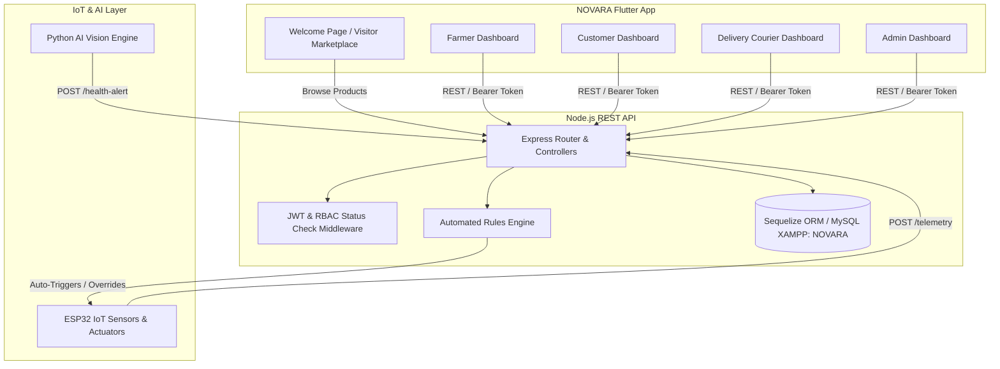

# NOVARA Smart Poultry System - Complete Implemented System Documentation

## Executive Summary

**NOVARA** is an end-to-end, cross-platform enterprise smart poultry farm automation and marketplace platform. It integrates:
* **Mobile / Web / Desktop UI**: Built with **Flutter** (Dart) featuring role-tailored dynamic dashboards and FCFA pricing.
* **Backend REST API**: Built with **Node.js** and **Express.js**.
* **Database & ORM**: **Sequelize ORM** connecting directly to **MySQL in XAMPP** (Database: `NOVARA`).
* **IoT Hardware Integration**: Telemetry ingestion and automated actuation rules engine for **ESP32** microcontrollers (feeders, water pumps, climate fans/heaters) with manual control override toggles.
* **AI Computer Vision Integration**: Real-time disease detection and poultry health anomaly alerting pipeline.

---

## 🏗️ System Architecture & Data Flow



---

## 📂 Project Repository Structure

```text
MY PROJECT/
├── Smart_Poultry_Farm_Development_Phases.md        # Roadmap document
├── Smart_Poultry_Farm_Full_System_Documentation.md  # Full NOVARA system documentation
│
├── BACK END/                                        # Express.js REST API Backend
│   ├── index.js                                    # Server entry point & DB sync
│   ├── package.json                                # Dependencies (express, sequelize, jwt, etc.)
│   ├── .env                                        # Environment configuration (DB_NAME=NOVARA)
│   ├── .env.example                                # Environment template
│   ├── test_backend.js                             # Integration test suite
│   └── src/
│       ├── config/database.js                      # MySQL XAMPP connection & auto DB creation
│       ├── middleware/                             # JWT auth & status check (suspended/blocked)
│       ├── models/                                 # Relational models (User, Farm, Device, etc.)
│       ├── controllers/                            # Business logic controllers
│       └── routes/                                 # Express API routers
│
└── FRONT END/                                       # NOVARA Flutter Cross-Platform App
    ├── pubspec.yaml                                # Packages (http, provider, fl_chart, intl)
    ├── build/web/                                  # Production web build artifacts
    └── lib/
        ├── main.dart                               # Application entry point & theme
        ├── config/api_config.dart                  # Base URL & API header helpers
        ├── services/api_service.dart               # REST HTTP API client service
        ├── providers/                              # State providers (AuthProvider, CartProvider)
        └── screens/
            ├── welcome_screen.dart                 # NOVARA Welcome Home Page
            ├── visitor_marketplace_screen.dart     # Visitor read-only catalog in FCFA
            ├── profile_screen.dart                 # Universal user profile & avatar editor
            ├── auth/                               # Login & Register UI with eye toggle
            ├── dashboards/                         # 4 Role Dashboards (Farmer, Customer, Driver, Admin)
            └── notifications_screen.dart           # Multi-channel alert feed screen
```

---

## 🔐 Role-Based Access Control (RBAC) & Status Governance

The system enforces permission boundaries across 4 user roles, with status enforcement (`active`, `suspended`, `blocked`):

| User Role | Dashboard Permissions & Scope |
| :--- | :--- |
| **Visitor** | Read-only access to browse the NOVARA marketplace catalog in **FCFA**. Attempting to order prompts sign in/registration. |
| **Farmer** | Owns & manages farms, registers ESP32 hardware, configures automation thresholds, views live sensor gauges/charts, reviews historical sensor logs, toggles Auto vs Manual control overrides, receives AI disease alerts, manages inventory in FCFA, accepts customer orders, and assigns delivery drivers. |
| **Customer** | Searches & filters products by category in **FCFA**, places orders, initiates payment (Mobile Money / Card in FCFA), and tracks order delivery status in real-time. |
| **Delivery Person** | Views assigned delivery tasks, updates status (`accepted` ➔ `picked_up` ➔ `delivered`), reports delayed deliveries with reason notes, and confirms successful fulfillment. |
| **Administrator** | Views platform analytics & financial reports in **FCFA**, manages farmers directory, creates new users directly, updates user accounts, suspends users, and blocks users. |

---

## 💻 Backend REST API Endpoints

| Group | Method | Endpoint | Description | Auth / Role Required |
| :--- | :--- | :--- | :--- | :--- |
| **Auth** | `POST` | `/api/auth/register` | Register user account with password hash & avatar | Public |
| | `POST` | `/api/auth/login` | Authenticate user & check account status | Public |
| | `GET` | `/api/auth/profile` | Retrieve active user profile | Authenticated |
| | `PUT` | `/api/auth/profile` | Update profile info & avatar image URL | Authenticated |
| **Farms** | `GET` | `/api/farms` | List farms (Farmer views owned; Admin views all) | Farmer / Admin |
| | `POST` | `/api/farms` | Create poultry farm record | Farmer / Admin |
| **Devices**| `GET` | `/api/devices` | List registered IoT devices by farm | Farmer / Admin |
| | `POST` | `/api/devices` | Register ESP32 IoT hardware cluster | Farmer / Admin |
| | `PUT` | `/api/devices/:id/mode` | Toggle automatic threshold control mode | Farmer / Admin |
| | `POST` | `/api/devices/:id/override`| Trigger manual actuator override | Farmer / Admin |
| **Sensors**| `POST` | `/api/sensors/telemetry`| Ingest ESP32 telemetry & run **Rules Engine** | IoT Device / Public |
| | `GET` | `/api/sensors/live/:id` | Get latest live telemetry snapshot | Authenticated |
| | `GET` | `/api/sensors/history/:id`| Get telemetry historical data points | Authenticated |
| **Orders** | `POST` | `/api/orders` | Place order, deduct stock (FCFA) | Customer / Admin |
| | `POST` | `/api/orders/:id/pay` | Initiate & complete FCFA payment (Mobile Money/Card)| Customer / Admin |
| | `GET` | `/api/orders` | View order history | Authenticated |
| **Delivery**|`GET` | `/api/deliveries` | View driver assigned delivery tasks | Driver / Farmer / Admin |
| | `PUT` | `/api/deliveries/:id/delay` | Report delayed delivery with reason note | Driver / Admin |
| | `PUT` | `/api/deliveries/:id/confirm`| Confirm successful delivery fulfillment | Driver / Admin |
| **Admin** | `GET` | `/api/admin/stats` | Platform overview analytics summary | Administrator |
| | `GET` | `/api/admin/reports` | Detailed financial & sales report in FCFA | Administrator |
| | `GET` | `/api/admin/farmers` | List of farmers and their farms | Administrator |
| | `POST` | `/api/admin/users` | Create user account directly | Administrator |
| | `PUT` | `/api/admin/users/:id` | Update user details | Administrator |
| | `PUT` | `/api/admin/users/:id/status`| Suspend or Block user account | Administrator |

---

## 🚀 How to Launch NOVARA

### 1. Start XAMPP MySQL
Ensure MySQL module is running in XAMPP Control Panel. The database `NOVARA` will be verified/created automatically on server startup.

### 2. Start the Backend API Server
```bash
cd "c:\Users\Dalia Tchoutan\Desktop\MY PROJECT\BACK END"
npm run dev
```

### 3. Launch the NOVARA Flutter App

#### Run in Chrome Web Browser:
```bash
cd "c:\Users\Dalia Tchoutan\Desktop\MY PROJECT\FRONT END"
flutter run -d chrome
```

#### Run as Windows Desktop App:
```bash
cd "c:\Users\Dalia Tchoutan\Desktop\MY PROJECT\FRONT END"
flutter run -d windows
```
