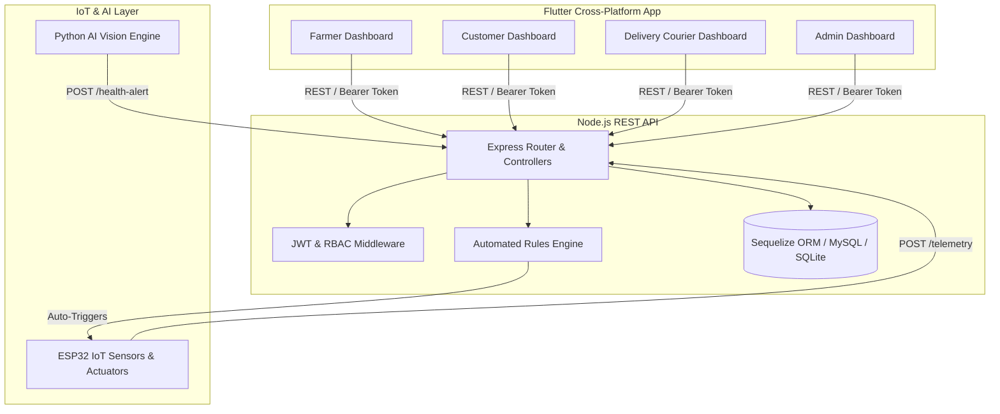

# Smart Poultry Farm Automation System - Complete Implemented System Documentation

## Executive Summary

The **Smart Poultry Farm Automation System** is an end-to-end, cross-platform enterprise management platform. It integrates:
* **Mobile / Web / Desktop UI**: Built with **Flutter** (Dart) featuring role-tailored dynamic dashboards.
* **Backend REST API**: Built with **Node.js** and **Express.js**.
* **Database & ORM**: **Sequelize ORM** connecting directly to **MySQL in XAMPP**.
* **IoT Hardware Integration**: Telemetry ingestion and automated actuation rules engine for **ESP32** microcontrollers (feeders, water pumps, climate fans/heaters).
* **AI Computer Vision Integration**: Real-time disease detection and poultry health anomaly alerting pipeline.

---

## 🏗️ System Architecture & Data Flow



---

## 📂 Project Repository Structure

```text
MY PROJECT/
├── Smart_Poultry_Farm_Development_Phases.md     # Development roadmap document
├── Smart_Poultry_Farm_Full_System_Documentation.md # Full system documentation
│
├── BACK END/                                     # Express.js REST API Backend
│   ├── index.js                                 # Server entry point & DB sync
│   ├── package.json                             # Dependencies (express, sequelize, jwt, etc.)
│   ├── .env                                     # Environment configuration
│   ├── .env.example                             # Environment template
│   ├── test_backend.js                          # Integration test suite (100% pass)
│   └── src/
│       ├── config/database.js                   # Sequelize ORM setup & fallback
│       ├── middleware/                          # JWT auth & RBAC authorization
│       ├── models/                              # Relational models (User, Farm, Device, etc.)
│       ├── controllers/                         # Business logic controllers
│       └── routes/                              # Express API routers
│
└── FRONT END/                                    # Flutter Cross-Platform App
    ├── pubspec.yaml                             # Packages (http, provider, fl_chart, intl)
    ├── build/web/                               # Production web build artifacts
    └── lib/
        ├── main.dart                            # Application entry point & theme
        ├── config/api_config.dart               # Base URL & API header helpers
        ├── services/api_service.dart            # REST HTTP API client service
        ├── providers/                           # State providers (AuthProvider, CartProvider)
        └── screens/
            ├── splash_screen.dart               # Auto-login & role router
            ├── auth/                            # Login & Register UI screens
            ├── dashboards/                      # 4 Role Dashboards (Farmer, Customer, Driver, Admin)
            └── notifications_screen.dart        # Multi-channel alert feed screen
```

---

## 🔐 Role-Based Access Control (RBAC)

The system enforces strict permission boundaries across 4 distinct user roles:

| User Role | Dashboard Permissions & Scope |
| :--- | :--- |
| **Farmer** | Owns & manages farms, registers ESP32 hardware, configures automation thresholds, views live sensor gauges/charts, receives AI disease alerts, manages marketplace inventory, accepts orders, and assigns delivery drivers. |
| **Customer** | Browses marketplace catalog, filters products by category & price, manages shopping cart, checks out, and tracks order delivery status in real-time. |
| **Delivery Person** | Views assigned delivery tasks, access customer contact/location details, and updates delivery stages (`accepted` ➔ `picked_up` ➔ `delivered`). |
| **Administrator** | Views platform analytics dashboard (users, farms, devices, orders, gross revenue) and governs user accounts & role assignments. |

---

## 💻 1. Backend REST API Implementation (`BACK END`)

### Models & Schema ([`src/models/`](file:///c:/Users/Dalia%20Tchoutan/Desktop/MY%20PROJECT/BACK%20END/src/models))
* **`User`**: UUID primary key, name, email, bcrypt password hash, role enum, phone, address.
* **`Farm`**: Name, location, total capacity, current poultry count, farmer foreign key.
* **`Device`**: Device serial, type, status, farm foreign key, threshold parameters (`foodThreshold`, `waterThreshold`, `tempMin`, `tempMax`, `humidityMin`, `humidityMax`).
* **`SensorReading`**: High-frequency telemetry log (food %, water %, temp °C, humidity %).
* **`Product`**: Farm foreign key, name, description, price, stock quantity, unit, category, image URL.
* **`Order`** & **`OrderItem`**: Customer foreign key, total amount, status enum, shipping address, line items.
* **`Delivery`**: Order foreign key, delivery person foreign key, pickup/dropoff address, status enum.
* **`Notification`**: User foreign key, title, message, type enum (`ai_alert`, `environmental_alert`, `order_update`, `delivery_update`), read state.

### API Endpoints Summary Table

| Group | Method | Endpoint | Description | Auth / Role Required |
| :--- | :--- | :--- | :--- | :--- |
| **Auth** | `POST` | `/api/auth/register` | Register user account with hashed password | Public |
| | `POST` | `/api/auth/login` | Authenticate user & issue 7-day JWT token | Public |
| | `GET` | `/api/auth/profile` | Retrieve active user profile | Authenticated |
| **Farms** | `GET` | `/api/farms` | List farms (Farmer views owned; Admin views all) | Farmer / Admin |
| | `POST` | `/api/farms` | Create farm record | Farmer / Admin |
| | `PUT` | `/api/farms/:id` | Update farm details | Farmer / Admin |
| | `DELETE`| `/api/farms/:id` | Delete farm | Farmer / Admin |
| **Devices**| `GET` | `/api/devices` | List registered IoT devices by farm | Farmer / Admin |
| | `POST` | `/api/devices` | Register ESP32 IoT hardware | Farmer / Admin |
| | `PUT` | `/api/devices/:id` | Update automation sensor thresholds | Farmer / Admin |
| **Sensors**| `POST` | `/api/sensors/telemetry`| Ingest ESP32 telemetry & run **Rules Engine** | IoT Device / Public |
| | `GET` | `/api/sensors/live/:id` | Get latest live telemetry snapshot | Authenticated |
| | `GET` | `/api/sensors/history/:id`| Get telemetry historical data points | Authenticated |
| **AI** | `POST` | `/api/ai/health-alert` | Ingest Python CV disease warnings | AI Service / Public |
| **Products**|`GET` | `/api/products` | Browse marketplace products (search & category) | Public |
| | `POST` | `/api/products` | Add product to farm inventory | Farmer / Admin |
| | `DELETE`| `/api/products/:id` | Remove product from inventory | Farmer / Admin |
| **Orders** | `POST` | `/api/orders` | Checkout cart, deduct stock, create order | Customer / Admin |
| | `GET` | `/api/orders` | View order history | Authenticated |
| | `PUT` | `/api/orders/:id/status`| Update order status (`accepted`, `in_transit`, etc.)| Farmer / Admin |
| **Delivery**|`GET` | `/api/deliveries` | View driver assigned delivery tasks | Driver / Farmer / Admin |
| | `PUT` | `/api/deliveries/:id/assign`| Assign driver to delivery | Farmer / Admin |
| | `PUT` | `/api/deliveries/:id/status`| Update delivery status (`picked_up`, `delivered`)| Driver / Admin |
| **Notifs** | `GET` | `/api/notifications` | Fetch user alerts inbox | Authenticated |
| | `PUT` | `/api/notifications/read-all`| Mark all notifications as read | Authenticated |
| **Admin** | `GET` | `/api/admin/stats` | Platform overview analytics summary | Administrator |
| | `GET` | `/api/admin/users` | Platform user directory | Administrator |
| | `PUT` | `/api/admin/users/:id/role`| Modify user role privileges | Administrator |

---

## 🤖 2. Automated Rules Engine

When telemetry is posted to `/api/sensors/telemetry`, the backend automatically evaluates thresholds configured on the target `Device`:

1. **Food Level Check**: If `foodLevel` < `foodThreshold` % ➔ Automatically triggers `'AUTOMATIC_FEEDING_DISPENSER_ON'` and generates a `Low Food Level Warning` notification for the farmer.
2. **Water Level Check**: If `waterLevel` < `waterThreshold` % ➔ Automatically triggers `'AUTOMATIC_WATER_VALVE_OPEN'` and generates a `Low Water Level Warning` notification for the farmer.
3. **High Temperature Check**: If `temperature` > `tempMax` °C ➔ Automatically triggers `'FAN_COOLING_ON'` and generates a `Temperature Threshold Alert`.
4. **Low Temperature Check**: If `temperature` < `tempMin` °C ➔ Automatically triggers `'HEATER_ON'` and generates a `Temperature Threshold Alert`.

---

##📱 3. Flutter Application Implementation (`FRONT END`)

### Architecture & State Providers ([`FRONT END/lib/providers/`](file:///c:/Users/Dalia%20Tchoutan/Desktop/MY%20PROJECT/FRONT%20END/lib/providers))
* **`AuthProvider`**: Manages sign in, sign up, token persistence in `SharedPreferences`, auto-login, and role routing.
* **`CartProvider`**: Reactive shopping cart state management, quantity updating, price calculations, and checkout payload generation.

### Screen Breakdown ([`FRONT END/lib/screens/`](file:///c:/Users/Dalia%20Tchoutan/Desktop/MY%20PROJECT/FRONT%20END/lib/screens))

#### 1. Splash & Auth Screens
* **`SplashScreen`**: Checks saved JWT token in `SharedPreferences`, auto-authenticates, and routes directly to the corresponding role dashboard.
* **`LoginScreen`**: Clean sign-in form with email & password validation.
* **`RegisterScreen`**: Account creation form with a role selector dropdown (`Farmer`, `Customer`, `Delivery Person`, `Administrator`).

#### 2. Role Dashboards
* **`FarmerDashboard`**:
  - *Farms Tab*: Farm CRUD (Add farm modal, view capacities & poultry counts).
  - *IoT Telemetry Tab*: Real-time gauges for food level %, water level %, temperature °C, and humidity %. Includes action buttons to simulate ESP32 hardware telemetry and test automated dispenser/cooling fan triggers.
  - *AI Alerts Tab*: Lists AI disease detection warnings with confidence scores.
  - *Products Tab*: Add/remove marketplace products, update stock quantities and pricing.
  - *Orders Tab*: Incoming order fulfillment and status transitions (`accepted`, `rejected`, `in_transit`, `delivered`).
* **`CustomerDashboard`**:
  - *Marketplace Tab*: Responsive product grid with category chips (Live Poultry, Eggs, Meat, Feed) and live keyword search.
  - *Cart & Checkout Modal*: Bottom sheet cart review, shipping address entry, and order placement.
  - *Orders & Tracking Tab*: Live status tracking (`pending`, `in_transit`, `delivered`).
* **`DeliveryDashboard`**:
  - Driver task cards with pickup/dropoff locations, customer phone numbers, and state transitions (`Accept` ➔ `Mark Picked Up` ➔ `Confirm Delivered`).
* **`AdminDashboard`**:
  - *Platform Analytics Tab*: Live summary metric cards (Total Users, Total Farms, Active Devices, Total Orders, and Platform Revenue).
  - *User Governance Tab*: Account directory with dropdown role modification (`Administrator`, `Farmer`, `Customer`, `Delivery Person`).

#### 3. Notifications Screen
* **`NotificationsScreen`**: Central multi-channel notification inbox with color-coded alert badges (`ai_alert`, `environmental_alert`, `order_update`, `delivery_update`) and mark-as-read toggles.

---

## 🚀 4. How to Run the Complete System

### 1. Start the Backend API Server
```bash
cd "BACK END"
npm run dev
```
* Backend starts listening on `http://localhost:3000`.

### 2. Run Backend Integration Tests (Optional)
```bash
cd "BACK END"
node test_backend.js
```
* Executes 10 automated test suites verifying DB sync, auth, IoT telemetry, AI alerts, order checkout, and notifications (100% pass).

### 3. Launch the Flutter App

#### Run in Web Browser:
```bash
cd "FRONT END"
flutter run -d chrome
```

#### Run as Windows Desktop App:
```bash
cd "FRONT END"
flutter run -d windows
```

---

## 📌 Summary Matrix of Completed Roadmap Phases

| Phase # | Development Phase | Implementation Status |
| :---: | :--- | :---: |
| **Phase 1** | Project Setup (Express REST API, Sequelize ORM, Flutter Scaffold) | ✅ Completed |
| **Phase 2** | Authentication & User Management (JWT, Bcrypt, 4 User Roles) | ✅ Completed |
| **Phase 3** | Farm Management (Farm CRUD, Farmer association) | ✅ Completed |
| **Phase 4** | IoT Device Management (ESP32 registration, thresholds) | ✅ Completed |
| **Phase 5** | Sensor Monitoring (Telemetry ingestion & history) | ✅ Completed |
| **Phase 6** | Automation Engine (Feed/water dispensers & climate control) | ✅ Completed |
| **Phase 7** | AI Health Detection (CV anomaly ingest & alerts) | ✅ Completed |
| **Phase 8** | Product Management (Inventory & catalog CRUD) | ✅ Completed |
| **Phase 9** | Online Marketplace (Public catalog search & filtering) | ✅ Completed |
| **Phase 10** | Order Management (Checkout, stock deduction, order workflow) | ✅ Completed |
| **Phase 11** | Delivery Management (Logistics tracking & driver assignment) | ✅ Completed |
| **Phase 12** | Notification System (Alert inbox & read tracking) | ✅ Completed |
| **Phase 13** | Administration (Platform stats & user governance) | ✅ Completed |
| **Phase 14** | Testing & Deployment (Automated test suite & production web build) | ✅ Completed |
