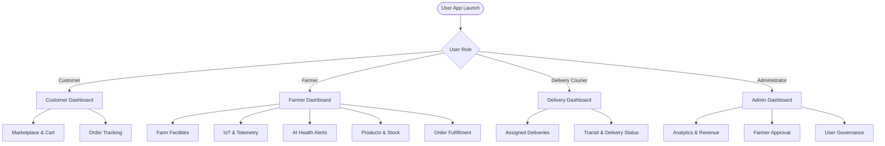

# NOVARA Smart Poultry System — User Guide
*Innovation Nouvelle Ère Pour L'Agriculture*

---

## 1. Introduction & Overview

Welcome to **NOVARA**, an intelligent, end-to-end smart poultry farm automation and agricultural marketplace platform. 

NOVARA bridges the gap between modern farm automation and consumers by combining:
- **Smart Farm IoT Automation**: Real-time environmental monitoring (temperature, humidity, water levels, food levels) and automated actuation (automated feeders, fans, heaters, water valves).
- **AI Computer Vision**: Early detection of poultry flock abnormalities, lethargy, and health anomalies.
- **Direct-from-Farm Marketplace**: Transparent digital commerce for fresh chicken, eggs, chicks, feed, and poultry products priced in FCFA.
- **Multi-Role Coordination**: Seamless collaboration between **Customers**, **Farmers**, **Delivery Couriers**, and **System Administrators**.
- **Bilingual Interface**: One-tap switching between **English (EN)** and **Français (FR)**.

---

## 2. Getting Started

### 2.1 Supported Platforms
- **Mobile Application**: Android & iOS (Flutter).
- **Web Application**: Responsive modern web dashboard.
- **Desktop**: Windows desktop application.

### 2.2 Language Selection
At the top-right corner of every screen (Welcome screen, Login, and Dashboards), tap the **Language Switcher** pill:
- Tap **EN** for English.
- Tap **FR** for Français.
All dashboard tabs, labels, alerts, status indicators, and currencies update instantly.

---

## 3. Account Creation & Security

### 3.1 Public Account Registration
From the Welcome screen, tap **"Create Account"** / **"S'inscrire"**.

You can register under one of three public roles:
1. **Customer (Client)**: For individuals or businesses purchasing poultry, eggs, and farm products.
2. **Farmer (Éleveur)**: For poultry farm owners managing flocks, coops, IoT equipment, and inventory.
3. **Delivery Person (Livreur)**: For logistics agents and couriers delivering customer orders.

> [!IMPORTANT]
> **Admin Account Security**:
> For security reasons, the **Admin** role cannot be self-registered through the public registration form. Admin privileges can only be provisioned internally by authorized system personnel.

### 3.2 Farmer & Courier Verification Workflow
- **Customer Accounts**: Activated immediately upon registration.
- **Farmer & Courier Accounts**: After registration, accounts enter a **"Pending Verification"** state. An Administrator reviews farm credentials and business verification before approving the account for marketplace publishing.

---

## 4. Visitor Mode (Guest Marketplace)

You do not need an account to browse available farm products!

1. On the Welcome screen, tap **"Explore Marketplace as Visitor"**.
2. Filter products by category:
   - **All Products**
   - **Live Poultry** (Broilers, Layer Hens, Roosters, Day-old Chicks)
   - **Eggs** (Farm Fresh Table Eggs, Brown Eggs, Fertile Hatching Eggs)
   - **Meat** (Dressed Chicken, Packaged Poultry Cuts)
   - **Feed** (Layer Mash, Broiler Starter, Grower Crumble)
3. Tap on any product to view farm details, producer name, price per unit in FCFA, and available inventory.
4. When you are ready to purchase, tap **"Add to Cart"** or **"Login to Order"** to sign in or create your customer account.

---

## 5. Role-Specific User Guides

---

### 5.1 Customer Guide (Client)

The **Customer Dashboard** provides a seamless digital shopping experience for fresh poultry farm goods.

#### Shopping & Ordering Flow:
1. **Browse & Search**:
   - Browse through categories using the horizontal category pills.
   - Use the search bar to locate specific breeds, feed types, or egg trays.
2. **Add Items to Cart**:
   - Tap the **"+"** button on any product card.
   - A live cart badge counter in the top bar reflects your total items.
3. **Review Cart**:
   - Tap the **Cart Icon** in the top navigation bar.
   - Adjust quantities with the `+` and `-` buttons. Subtotals and overall cart total recalculate instantly.
4. **Checkout**:
   - Tap **"Proceed to Checkout"**.
   - Confirm your **Delivery Address** and **Contact Phone Number**.
   - Select your payment method and tap **"Confirm Order"**.
5. **Order Tracking**:
   - Navigate to the **"My Orders"** section.
   - View the live status of your order:
     - `pending`: Order received by the farmer.
     - `processing`: Order is being packaged at the farm.
     - `in_transit`: Handed over to a delivery courier.
     - `delivered`: Safely delivered to your address.

---

### 5.2 Farmer Guide (Éleveur)

The **Farmer Dashboard** is the command center for modern poultry farming, organized into **5 specialized tabs**:

#### Tab 1: Farms Management (`Farms`)
- **View Farm Profile**: Inspect total bird capacity, active poultry count, and farm verification status.
- **Add Farm**: Tap the floating action button (`+`) to register a new coop, pasture, or hatchery facility.
- **Farm Details**: Tap on any farm card to open detailed specifications, IoT device linkages, and quick edit shortcuts.

#### Tab 2: IoT Devices & Environmental Automation (`IoT Monitoring`)
- **Device Clusters**: View connected **ESP32** microcontroller clusters installed in coops.
- **Live Environmental Gauges**:
  - **Temperature (°C)**: Color-coded safe range gauge (18°C – 32°C).
  - **Humidity (%)**: Optimal humidity range indicator (50% – 75%).
  - **Feed Hopper Level (%)**: Real-time ultrasonic food reserve sensor.
  - **Water Reservoir Level (%)**: Real-time water tank float sensor.
- **Configuring Thresholds**: Tap **"Configure Thresholds"** to adjust trigger limits:
  - *Food Threshold*: If feed drops below set % (e.g. 25%), triggers `AUTOMATIC_FEEDING_DISPENSER_ON`.
  - *Water Threshold*: If water drops below set % (e.g. 20%), triggers `AUTOMATIC_WATER_VALVE_OPEN`.
  - *Temperature Max*: If heat exceeds max limit (e.g. 32°C), triggers `FAN_COOLING_ON`.
  - *Temperature Min*: If temperature drops below min limit (e.g. 18°C), triggers `HEATER_ON`.
- **Manual Automation Override**: Toggle between automatic sensor control and manual actuator overrides.

#### Tab 3: AI Health & Flock Anomaly Alerts (`AI Alerts`)
- **Computer Vision Pipeline**: The automated camera monitors flock movement, isolation, posture, and respiratory distress.
- **Health Diagnosis**: Each alert displays the detected anomaly (e.g., *Lethargy & Flocking Isolation*), severity badge, and AI confidence score (e.g., 94%).
- **Actionable Resolution**: Tap on any alert card to view recommended quarantine or treatment steps, and tap **"Acknowledge / Mark as Read"** to log the resolution.
- **Notification Center**: Tap the top **"Open Notification Center"** button to view all historical environmental and health alerts.

#### Tab 4: Products & Inventory Catalog (`Products`)
- **Add Product**: Tap **"+ Add Product"** to publish a new inventory listing.
  - Select Category: *Live Poultry*, *Eggs*, *Meat*, or *Feed*.
  - Upload or select product photography.
  - Enter stock quantity, price in FCFA, and unit (per bird, per tray of 30, per kg, per 50kg bag).
- **Edit / Update Stock**: Tap any product card to adjust prices or replenish inventory.
- **Delete Product**: Delete obsolete listings with an automatic confirmation safeguard.

#### Tab 5: Orders & Courier Assignment (`Orders`)
- **Incoming Orders**: Review orders placed by customers for your farm's products.
- **Inspect Order Details**: Tap on any order card to see customer name, shipping address, contact phone, and purchased item quantities.
- **Status Progression**: Update order states from `pending` → `processing` → `ready_for_pickup`.
- **Assign Delivery Courier**: Tap **"Assign Courier"** to select an approved delivery person to pick up and deliver the package.

---

### 5.3 Delivery Courier Guide (Livreur)

The **Delivery Dashboard** allows couriers to accept, manage, and complete order deliveries.

1. **Active Deliveries**: View all orders assigned to you by farmers.
2. **Order Info Card**:
   - Pickup Farm Location & Producer contact.
   - Customer Delivery Address & One-tap call button.
   - Package contents and order total.
3. **Updating Status**:
   - Tap **"Start Delivery"** when departing the farm (status updates to `in_transit`, notifying the customer).
   - Tap **"Mark as Delivered"** upon successful drop-off (status updates to `delivered`).
4. **Notifications**: Receive instant alerts when a new order is assigned to you.

---

### 5.4 System Administrator Guide (Admin)

The **Admin Dashboard** provides governance, analytics, and security oversight across the entire ecosystem.

#### Tab 1: Reports & Revenue
- **Ecosystem KPI Cards**:
  - Total registered users broken down by role.
  - Total verified farms and coops.
  - Active IoT sensor nodes deployed in the field.
  - Gross merchandise value (GMV) and transaction volume in FCFA.
- **Export & Analytics**: Review system performance and growth trends.

#### Tab 2: Farmers Directory & Verification
- **Farmer Applications**: Review newly registered farmers awaiting platform access.
- **Verification Review**: Check farm location, poultry capacity, and contact credentials.
- **Approval Actions**:
  - Tap **"Approve"** to activate the farmer's account and enable marketplace listing.
  - Tap **"Reject"** if documentation is incomplete.

#### Tab 3: User Governance & Security
- **User Account Management**: Search and filter accounts by role (*Farmer*, *Customer*, *Delivery*, *Admin*).
- **Account State Toggles**: Suspend, deactivate, or reactivate accounts to maintain platform security.

---

## 6. Notifications & Profile Management

### 6.1 Notifications Center
Tap the **Bell Icon** on any dashboard AppBar:
- **Badge Indicator**: Displays unread alert counts.
- **Filter Alerts**: View environmental warnings, AI health alerts, order status changes, and administrative notices.
- **Mark as Read**: Tap **"Mark All as Read"** or dismiss individual items.

### 6.2 Profile & Settings
Tap your **Avatar / Profile Icon** on any dashboard:
- View your registered name, email, phone number, and system role.
- Upload an updated profile photo.
- Change your account password securely.
- Log out of your session safely.

---

## 7. Troubleshooting & FAQs

### Q: Why can't I see the Admin option when registering?
**A**: Admin accounts cannot be created publicly to ensure platform integrity and data protection. System administrators must be provisioned internally by existing authorized administrators.

### Q: What if my farm's Wi-Fi disconnects from the IoT device?
**A**: The ESP32 device maintains its last known automation thresholds locally. Once Wi-Fi reconnects, it automatically flushes queued telemetry data to the backend.

### Q: How do I change the language from English to French?
**A**: Tap the **EN / FR** toggle at the top-right corner of any screen. The entire application translates instantly.

### Q: Can I run the application offline?
**A**: You can browse cached products and offline pages. Submitting orders, updating farm thresholds, and receiving live sensor telemetry require an active internet connection to communicate with the backend server.
